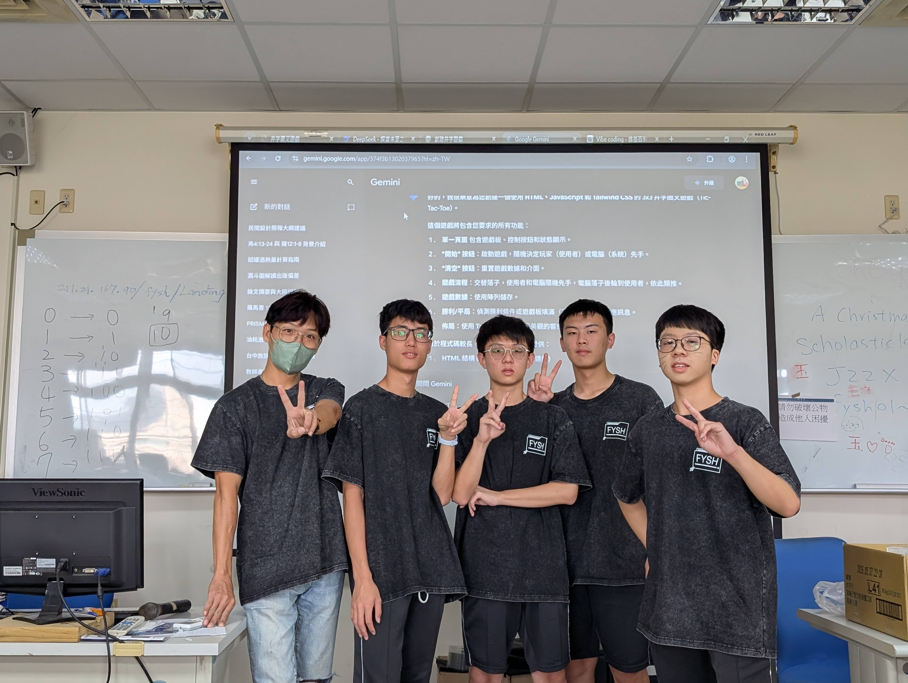

# 豐原高中 資訊研究社與 Google Gemini 社團協作成果

*響應「[Google Gemini 全台高中社團祭](https://rsvp.withgoogle.com/events/gemini-for-clubs/)」，  
我們是來自 [臺中市立豐原高中](https://fysh.tc.edu.tw/) 的資訊研究社。  
我們利用 Gemini 這位「AI 神社員」，協助我們進行社團活動企劃、文案撰寫及程式開發輔助。*

---
## 成果說明

在這次的協作中，我們將 Gemini 應用於多個方面。  
我們利用它來「腦力激盪企劃」 創建互動遊戲為我們的年度成果展發想了許多創意點子。
此外，Gemini 在「製作文案」  
([Facebook 活動貼文](https://www.facebook.com/groups/2294169410829101/posts/4282788468633842/))  
方面也給了我們極大幫助，社團介紹和活動宣傳文案都變得更加吸引人。
身為資訊研究社，我們也嘗試讓 Gemini「協助寫程式」 它幫助我們除錯並優化了遊戲。

- **協作項目一：** 遊戲活動企劃
- **協作項目二：** 社交媒體宣傳文案撰寫
- **協作項目三：** 遊戲程式碼優化
---

## 成果照片

這是我們社團成員實際使用 Gemini 進行討論，以及我們舉辦活動時的照片紀錄。

---

## 成果影片

我們將這次的協作經驗製作成一支分享影片，展現 Gemini 如何成為我們最強的學習隊友。

---

> 🧠 *「AI 並非取代我們，而是成為我們的夥伴。」 — 豐原高中資訊研究社*
